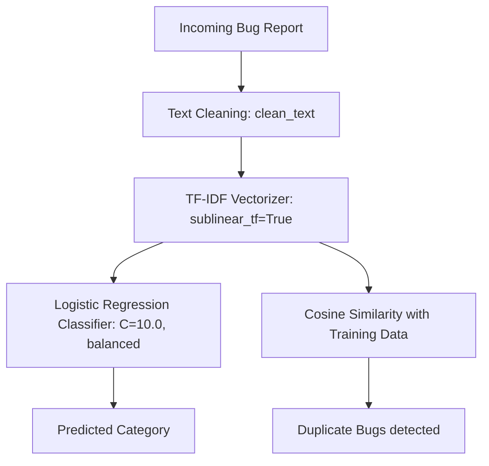

# Technical Reference: AI Bug Classifier Architecture & Algorithms

This document explains the internal mechanics, algorithms, and key functions used in the AI Bug Classifier system.

---

## 🧠 1. Machine Learning Pipeline Overview

The system uses a **supervised machine learning pipeline** for text classification, combined with **vector space similarity** for duplicate detection.



---

## 🛠️ 2. Feature Extraction & Vectorization

Computers cannot read raw text; they require numbers. The model converts text into numeric features using **TF-IDF**.

### TF-IDF Vectorizer (`TfidfVectorizer`)
* **Algorithm:** **Term Frequency-Inverse Document Frequency (TF-IDF)**
  * **Term Frequency (TF):** Measures how often a word appears in a document.
  * **Inverse Document Frequency (IDF):** Down-weights words that appear in almost all documents (like "the", "and", "is"), as they are not helpful for separating categories.
* **Configurations Used:**
  * `stop_words='english'`: Filters out common English filler words.
  * `ngram_range=(1, 2)`: Extracts both single words (e.g., `"login"`) and two-word phrases (e.g., `"login form"`, `"sql injection"`).
  * `sublinear_tf=True`: Uses logarithmic scaling for term counts ($\text{TF} = 1 + \log(\text{TF})$). This prevents a word repeated 10 times in a single bug description from being treated as 10 times more important than a word appearing once.

---

## 🏷️ 3. Classification Algorithm

### Logistic Regression (`LogisticRegression`)
* **Algorithm:** Logistic Regression with a **one-vs-rest (OVR)** multiclass framework.
* **Configurations Used:**
  * `C=10.0`: The inverse regularization strength. A higher value ($C=10.0$) allows the model to fit closer to the training keywords, ensuring highly precise class separation.
  * `class_weight='balanced'`: Resolves dataset imbalance. If the dataset has 3,000 UI bugs and 70 integration bugs, the algorithm automatically boosts the significance of the integration bugs during training.
  * `solver='liblinear'`: A solver optimized for small-to-medium-sized datasets and linear text classification tasks.

---

## 🔍 4. Similarity & Duplicate Detection

### Cosine Similarity (`cosine_similarity`)
* **Algorithm:** Measures the cosine angle between two non-zero vectors in an inner product space.
* **Working:**
  1. The incoming bug is vectorized using the trained TF-IDF model.
  2. The cosine similarity is calculated between this vector and the 2,850 vectorized historical training bugs:
     $$\text{Similarity}(A, B) = \frac{A \cdot B}{\|A\| \|B\|}$$
  3. Any training bug with a similarity score $\ge 0.80$ is flagged as a potential duplicate.

---

## 💻 5. Key Functions & Code Methods

### Text Preprocessing: `clean_text(text)`
Located in [merge_and_train.py](file:///c:/Users/jeyas/Downloads/38833FF26BA1D.UnigramPreview_g9c9v27vpyspw!App/AI%20Bug%20classifier%20project/bug-classifier-ai/notebooks/merge_and_train.py).
Cleans and standardizes the input string:
```python
def clean_text(text):
    if not isinstance(text, str):
        return ""
    # 1. Remove URLs (http/https and www links)
    text = url_pattern.sub('', text)
    # 2. Remove HTML Tags (e.g., <div class="error">)
    text = html_pattern.sub('', text)
    # 3. Remove Emojis
    text = emoji_pattern.sub('', text)
    # 4. Remove consecutive duplicate words (e.g., "the the" -> "the")
    text = dup_pattern.sub(r'\1', text)
    # 5. Collapse extra white spaces and strip
    return re.sub(r'\s+', ' ', text).strip()
```

### Dataset Auto-Labeling: `load_and_standardize_dataset(file_path)`
Parses incoming CSV datasets. If a dataset has no categories (e.g. `filtered_data.xlsx%20-%20Sheet1.csv`), it applies keyword matching rules to bootstrap labels for training:
* **UI Bug:** `["alignment", "overlap", "truncation", "layout", "css", ...]`
* **Performance Issue:** `["slow", "latency", "timeout", "high cpu", ...]`
* **Security Vulnerability:** `["security", "injection", "vulnerability", "xss", ...]`

### Inference Engine: `BugPredictor` Class
Located in [predict.py](file:///c:/Users/jeyas/Downloads/38833FF26BA1D.UnigramPreview_g9c9v27vpyspw!App/AI%20Bug%20classifier%20project/bug-classifier-ai/api/predict.py).
* `load_models()`: Loads the serialized pickle files (`vectorizer.pkl` and `classifier.pkl`).
* `predict_category(title, description)`: Combines inputs, transforms them via TF-IDF, and outputs the predicted category. If pickle files are missing, it falls back to a rule-based regex keyword matcher.
* `predict_severity(title, description)`: Scans for severe keywords (e.g., `"crash"`, `"data loss"`, `"injection"`) to return `Critical`, `High`, `Medium`, or `Low`.
* `generate_root_cause_hints(...)`: Generates action items depending on the category. For example, if the category is `Configuration Error`, it recommends checking JSON/YAML syntax and env variables.
